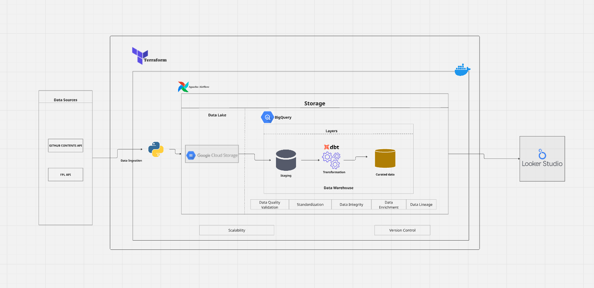
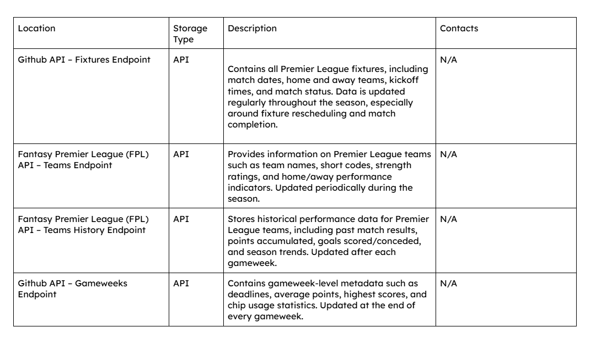

## Fantasy Premier League (FPL)

## Navigation / Quick Access
Quickly move to section you are interested in by clicking on appropriate link:

---
## Overview
Fantasy Premier League (FPL) has grown into one of the most widely followed fantasy sports platforms globally, engaging millions of football enthusiasts who actively analyze player and team performances to gain a competitive edge. Decision-making within FPL is highly data-driven, relying on accurate, timely, and well-structured information about Premier League teams, players, fixtures, and gameweeks.
Despite the availability of raw football data from multiple sources, this information is often fragmented, inconsistently structured, and not optimized for analytical use. Stakeholders such as fantasy football managers, analysts, and developers require a centralized and reliable data system that supports performance tracking, historical analysis, and forward-looking insights such as fixture difficulty and transfer optimization.

---
## Project Objective
The primary objective of this project is to address these challenges by focusing on the design of a scalable ELT (Extract, Load, Transform) data pipeline tailored specifically to Premier League data. By consolidating and transforming match, player, and team data into an analytics-ready format, the project aims to provide a strong data foundation that enables deeper performance analysis, trend identification, and informed decision-making within the Fantasy Premier League ecosystem.
This pipeline will enable stakeholders to:
Track and analyze key performance indicators (KPIs) for players and teams

- Monitor player and team performance trends over time

- Compare historical fixtures with upcoming matches

- Support informed decision-making for player transfers

- Maintain comprehensive player performance histories for future analysis

**The scope of this project is strictly limited to Premier League data.**

---

## Project Architecture

The data architecture is an overview of the end-to-end pipeline which include:

- The Ingestion of data into Amazon S3 (using python)
- Load it into a staging layer in BigQuery
- Transforming the data using dbt cloud
- creation of dashboard using Looker Studio

## Dataset Endpoints

---
## Technologies
- [Docker](https://www.docker.com/):- Containerization of applications -- build, share, run, and verify applications anywhere — without tedious environment configuration or management.
- [Google Cloud Storage](https://cloud.google.com/storage) GCS - Data Lake for storage
- [Google Cloud BigQuery](https://cloud.google.com/bigquery) - Data warehouse for analytical purposes
- [Terraform](https://www.terraform.io/) - Infrastructure as code (Infrastructure automation to provision and manage resources in any cloud or data center.)
- [Airflow](https://airflow.apache.org/) -  Data and workflow orchestration 
- [Dbt](https://www.getdbt.com/)- For analytics engineering via data transformation
- [Looker studio](https://lookerstudio.google.com/) - Data Visualization

---

# Data Sources Documentation

## Overview

This project ingests data from multiple external API endpoints to build a centralized, analytics-ready data platform.

1. **Teams**
2. **Players**
3. **Players Types**
4. **Fixtures**
5. **Gameweeks**

### 1. Teams

The **Teams** data source contains metadata and performance-related attributes for football teams participating in the league.  
Each record represents a **single team**, including identifiers, league standings, match outcomes, and strength metrics.

### Teams Data Dictionary

| Column Name | Data Type | Description |
|------------|-----------|-------------|
| `id` | Integer | Unique identifier for the team |
| `code` | Integer | Internal API-specific team code |
| `name` | String | Full name of the team |
| `short_name` | String | Abbreviated team name |
| `position` | Integer | Current league position (1 = highest) |
| `played` | Integer | Number of matches played |
| `win` | Integer | Number of matches won |
| `draw` | Integer | Number of matches drawn |
| `loss` | Integer | Number of matches lost |
| `points` | Integer | Total points accumulated |
| `form` | String / Null | Recent match form (e.g., `W,D,L,W,L`) |
| `strength` | Integer | Overall team strength rating |
| `strength_overall_home` | Integer | Overall strength when playing at home |
| `strength_overall_away` | Integer | Overall strength when playing away |
| `strength_attack_home` | Integer | Attacking strength at home |
| `strength_attack_away` | Integer | Attacking strength away |
| `strength_defence_home` | Integer | Defensive strength at home |
| `strength_defence_away` | Integer | Defensive strength away |
| `team_division` | String / Null | League division (if applicable) |
| `unavailable` | Boolean | Indicates whether the team is inactive or unavailable |
| `pulse_id` | Integer | Secondary identifier for live or pulse data feeds |

---
### 2. Players

The **Players** data source provides a detailed, player-level view of footballers participating in the competition.  It captures a broad spectrum of information, ranging from basic identity and team affiliation to advanced performance metrics, availability indicators, valuation trends, and comparative rankings.

---
### Player Data Dictionary

| Column Name | Data Type | Description |
|------------|-----------|-------------|
| `id` | Integer | Unique identifier assigned to the player |
| `code` | Integer | API-specific player reference code |
| `first_name` | String | Player’s first name |
| `second_name` | String | Player’s surname |
| `web_name` | String | Commonly used display name |
| `birth_date` | Date | Player’s date of birth |
| `team` | Integer | Identifier of the team the player belongs to |
| `team_code` | Integer | API-specific team code |
| `element_type` | Integer | Player position classification |
| `status` | String | Current availability status (e.g. available, injured) |
| `can_select` | Boolean | Indicates whether the player can be selected |
| `can_transact` | Boolean | Indicates whether the player can be transferred |
| `now_cost` | Integer | Current player cost (scaled by source system) |
| `selected_by_percent` | String | Percentage of managers selecting the player |
| `minutes` | Integer | Total minutes played |
| `starts` | Integer | Matches started |
| `total_points` | Integer | Cumulative fantasy points |
| `points_per_game` | String | Average points scored per game |
| `form` | String | Recent performance form indicator |
| `goals_scored` | Integer | Total goals scored |
| `assists` | Integer | Total assists |
| `clean_sheets` | Integer | Clean sheets recorded |
| `expected_goals` | String | Expected goals (xG) |
| `expected_assists` | String | Expected assists (xA) |
| `expected_goal_involvements` | String | Combined expected goal involvements (xGI) |
| `influence` | String | Influence score |
| `creativity` | String | Creativity score |
| `threat` | String | Threat score |
| `ict_index` | String | Composite ICT index score |
| `in_dreamteam` | Boolean | Indicates inclusion in the dream team |
| `dreamteam_count` | Integer | Number of dream team appearances |

---
### 3. Player Types Data Source

The Player Types dataset defines the positional framework of Fantasy Premier League (FPL). Each record represents a player role and specifies the rules governing squad composition, starting formations, and UI behavior.

This dataset serves as a foundational reference for enforcing team structure, validating lineups, and categorizing players across the platform.

---

## Data Dictionary

| Field | Type | Description |
|-----|-----|-------------|
| id | Integer | Unique identifier for the player type |
| plural_name | String | Full plural name of the position |
| plural_name_short | String | Abbreviated plural name |
| singular_name | String | Full singular position name |
| singular_name_short | String | Abbreviated singular name |
| squad_select | Integer | Required number in a 15-man squad |
| squad_min_play | Integer | Minimum starters in XI |
| squad_max_play | Integer | Maximum starters in XI |
| ui_shirt_specific | Boolean | Position-specific UI rendering |
| sub_positions_locked | Array | Locked substitute slots |
| element_count | Integer | Number of players in position |

---

### 4. Fixtures

The **Fixtures** data source provides match-level scheduling and outcome information for the competition.  
Each record represents a **single fixture** between a home team and an away team, capturing timing, status, scores, difficulty ratings, and detailed match statistics.

This dataset forms a critical link between team and player datasets and enables gameweek-based analysis, performance tracking, and historical comparisons.

### Fixtures Data Dictionary

| Column Name | Data Type | Description |
|------------|-----------|-------------|
| `id` | Integer | Unique fixture identifier |
| `code` | Integer | API-specific fixture code |
| `event` | Integer | Gameweek or event number |
| `kickoff_time` | Timestamp | Scheduled kickoff time |
| `provisional_start_time` | Boolean | Indicates provisional kickoff time |
| `started` | Boolean | Indicates if the match has started |
| `finished` | Boolean | Indicates if the match has completed |
| `finished_provisional` | Boolean | Indicates provisional completion |
| `minutes` | Integer | Total minutes played |
| `team_h` | Integer | Home team identifier |
| `team_a` | Integer | Away team identifier |
| `team_h_score` | Integer | Goals scored by home team |
| `team_a_score` | Integer | Goals scored by away team |
| `team_h_difficulty` | Integer | Home team difficulty rating |
| `team_a_difficulty` | Integer | Away team difficulty rating |
| `stats` | JSON | Nested match statistics |
| `pulse_id` | Integer | Secondary live data identifier |

---

### 5. Events (Gameweeks) Data Source

## Overview
The Events dataset represents Fantasy Premier League (FPL) gameweeks. Each event defines a competition window during which fixtures are played, fantasy points are accumulated, and managerial actions such as transfers and chip usage are governed.

Gameweeks serve as the temporal backbone of the FPL data model, linking fixtures, player performances, transfers, and rankings into a cohesive competition structure.

---
## Data Dictionary

| Field | Type | Description |
|-----|-----|-------------|
| id | Integer | Unique identifier for the gameweek |
| name | String | Display name of the gameweek |
| deadline_time | Timestamp | Official deadline before kickoff |
| finished | Boolean | Indicates if the gameweek has ended |
| is_current | Boolean | Marks the currently active gameweek |
| is_next | Boolean | Marks the upcoming gameweek |
| average_entry_score | Integer | Average score across all entries |
| highest_score | Integer | Highest score achieved |
| transfers_made | Integer | Total transfers made |
| most_captained | Integer | Most captained player |
| released | Boolean | Indicates public availability |
| overrides | Object | Rule and scoring overrides |

---
## Contact
Please reach out to me on [LinkedIn](https://www.linkedin.com/in/abdulraheemquwam/) for thoughts and/or issues encountered during reproduction of project. Let's chat! ⭐.

Happy Coding! 💻
